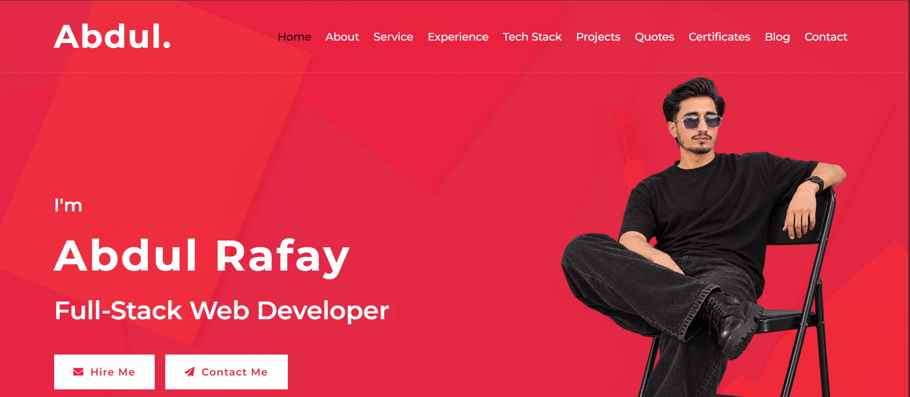

cat > /mnt/user-data/outputs/README.md << 'EOF'
# 🚀 Abdul Rafay — Personal Portfolio Website

> A modern, fully responsive personal portfolio website built with HTML5, CSS3, and JavaScript — showcasing Full-Stack Web Development, AI & Agentic AI, and Web3/Blockchain skills.



---

## 🌐 Live Demo

🔗 [View Portfolio](https://github.com/iabdul-rafay/My-Main-Portfolio)

---

## ✨ Features

- ⚡ **Animated Hero Section** — Typed.js text animation with smooth transitions
- 🔄 **Flip Card Animation** — Interactive about section with scroll-triggered 3D flip
- 🎨 **Animated SVG Banner** — Custom coded animated banner with asteroid belt orbit
- 📊 **Skill Progress Bars** — Animated skill bars with percentage indicators
- 🗂️ **Filterable Project Portfolio** — Filter projects by category (Full-Stack, AI, Web3)
- 📜 **Interactive Timeline** — Work experience and education timeline
- 🛠️ **Tech Stack Section** — Categorized technology cards with SVG icons
- 🏆 **Certificates Section** — Professional certificates showcase
- 💬 **Quotes Carousel** — Inspirational developer quotes with Owl Carousel
- 📬 **Contact Form** — Direct email contact form
- 📱 **Fully Responsive** — Mobile, tablet, and desktop optimized
- 🌀 **Smooth Animations** — WOW.js scroll animations throughout
- 📄 **CV Download** — One-click resume download
- 🔝 **Back to Top** — Smooth scroll back to top button
- 🖥️ **About Modal** — Detailed about me popup with full skill breakdown

---

## 🛠️ Technologies Used

### Frontend
| Technology | Purpose |
|------------|---------|
| HTML5 | Markup & Structure |
| CSS3 | Styling & Animations |
| JavaScript (ES6+) | Interactivity & Logic |
| Bootstrap 4 | Responsive Grid & UI |
| Font Awesome 5 | Icons |

### Libraries & Plugins
| Library | Purpose |
|---------|---------|
| Typed.js | Typing animation in hero section |
| Owl Carousel | Quotes/testimonial slider |
| WOW.js | Scroll-triggered animations |
| Animate.css | CSS animation library |
| Isotope.js | Portfolio filtering |
| Lightbox.js | Project image lightbox |
| Waypoints.js | Scroll detection |

### Design
| Tool | Purpose |
|------|---------|
| SVG Animations | Custom animated banners & icons |
| CSS 3D Transforms | Flip card animations |
| CSS Keyframes | Custom micro-animations |
| Linear Gradients | Hero & section backgrounds |

---

## 📁 Project Structure

```
My-Main-Portfolio/
│
├── index.html              # Main HTML file
├── css/
│   └── style.css           # Main stylesheet
├── js/
│   └── main.js             # Main JavaScript file
├── img/
│   ├── hero.png            # Hero section photo
│   ├── about.jpg           # About section photo
│   ├── abdul_rafay_banner.svg  # Animated SVG banner
│   ├── portfolio-1.jpg     # Project screenshots
│   ├── blog-1.jpg          # Blog images
│   └── ...
├── lib/
│   ├── animate/            # Animate.css
│   ├── owlcarousel/        # Owl Carousel
│   ├── lightbox/           # Lightbox
│   ├── wow/                # WOW.js
│   ├── typed/              # Typed.js
│   ├── waypoints/          # Waypoints.js
│   ├── easing/             # jQuery Easing
│   └── isotope/            # Isotope.js
└── README.md
```

---

## 🚀 Featured Projects

### 1. 🤖 myVISTA — AI Smart Home Controller
Bilingual (English/Urdu) voice-command smart home system with gesture controls, Firebase Realtime DB, and ESP32 IoT integration.
> **Stack:** Python, Firebase, TensorFlow Lite, ESP32, WebSocket

### 2. 🖼️ NFT Marketplace (Web3)
Full-stack NFT marketplace on Ethereum Sepolia testnet with MetaMask wallet, ERC-721 minting, and live crypto price charts.
> **Stack:** Solidity, React.js, Node.js, Hardhat, MetaMask, Cloudinary

### 3. 🏥 DocConnect — Healthcare Platform
MERN stack healthcare appointment platform with JWT auth, admin dashboard, and 20+ REST API endpoints.
> **Stack:** React.js, Node.js, Express.js, MongoDB, JWT

### 4. 🎬 MovieSent — ML Sentiment Analysis
ML sentiment classifier trained on 25,000 IMDB reviews achieving 91% accuracy, deployed as a Flask REST API.
> **Stack:** Python, Scikit-learn, Flask, TF-IDF, Logistic Regression

### 5. 🔐 DACVS — Blockchain Credential Verification
Decentralized academic credential verification system on Ethereum blockchain.
> **Stack:** Solidity, React.js, Ethereum, Hardhat

### 6. 🍳 Smart HomeChef — AI & IoT System
AI-powered smart kitchen assistant with IoT sensor integration.
> **Stack:** Python, TensorFlow Lite, IoT, React.js

---

## 🧑‍💻 About Me

**Abdul Rafay** — Motivated Fresh Graduate in BS Software Engineering from Capital University of Science and Technology (CUST). Passionate about Full-Stack Web Development, AI & Agentic AI systems, and Web3/Blockchain platforms.

- 📍 Rawalpindi / Islamabad, Pakistan
- 📧 iamrafay64@gmail.com
- 📞 +92 319 5292295

---

## 🔗 Connect With Me

[](https://github.com/iabdul-rafay)
[](https://www.linkedin.com/in/abdul-rafay-76b165320/)
[](https://x.com/iabdul_rafay)
[](https://www.instagram.com/iabdul.rafay7)

---

## ⚙️ Setup & Installation

```bash
# 1. Clone the repository
git clone https://github.com/iabdul-rafay/My-Main-Portfolio.git

# 2. Navigate to project folder
cd My-Main-Portfolio

# 3. Open in browser
# Simply open index.html in any browser
# OR use Live Server extension in VS Code
```

> No build tools or npm required — pure HTML/CSS/JS project!

---

## 📜 License

This project is open source and available under the [MIT License](LICENSE).

---

<p align="center">Made with ❤️ by <strong>Abdul Rafay</strong></p>
<p align="center">⭐ Star this repo if you found it helpful!</p>
EOF
echo "Done"
